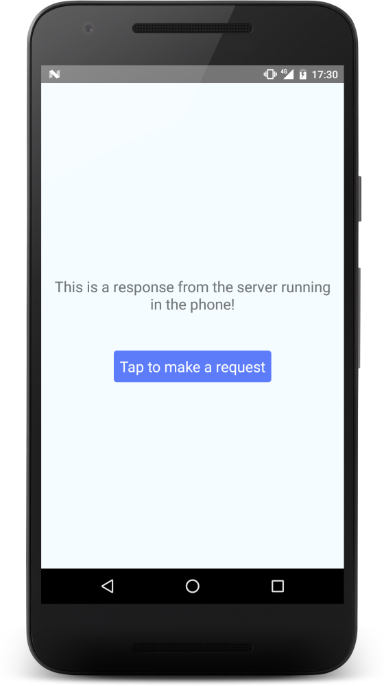

# React Native Node

*Run a **real** Node.js process in the background, behind a React Native app.*

Using this package you can: run `http` servers in Android, use Node streams, interface with the filesystem, off load some heavy processing out of the JS thread in React Native, and more! Running the real Node.js in Android, you can do everything that Node.js on desktop can.

- (only Android supported, for now. iOS support may come if [this project](http://www.janeasystems.com/blog/node-js-meets-ios/) evolves)
- (check also [node-on-mobile](https://github.com/node-on-mobile/node-on-android) if you're not using React Native)

[Example app](./example)



## Install

```
npm install --save react-native-node
```

```
react-native link react-native-node
```

## Usage

1. Develop the background Node.js project under some directory
    - e.g. `./background`

2. In your React Native JavaScript source files, spawn the background process:

```diff
+import RNNode from "react-native-node";

 class MyApp extends Component {
   // ...
   componentDidMount() {
+    RNNode.start();
+    // or specify arguments to the process:
+    RNNode.start(['--color', 'red', '--port', '3000'])
   }

   componentWillUnmount() {
+    RNNode.stop();
   }
   // ...
 }
```

3. Bundle and insert the background application into the mobile app using the command

```
./node_modules/.bin/react-native-node insert ./background
```

- Compresses your background app into `./android/app/src/main/res/raw/rnnodebundle`
- Updates `AndroidManifest.xml` to include a Service class

4. (Re)build the mobile app

```
react-native run-android
```

### Tip 1

If you want to bundle and insert the background app always before building the mobile app, make a `prestart` package.json script (assuming you use the `start` script):

```diff
 "scripts": {
+  "prestart": "react-native-node insert ./background",
   "start": "node node_modules/react-native/local-cli/cli.js start",
```

### Tip 2

You can reduce the size of the bundle file `rnnodebundle` by using a tool like [noderify](https://www.npmjs.com/package/noderify) to create a single js file.

## FAQ

#### How is this possible?

Node.js v7.1.0 (with V8, not JavaScriptCore) was compiled to a binary `bin_node_v710` following the approach used by ["NodeBase"](https://github.com/dna2github/NodeBase). This binary is prebuilt and included in this library. If you are concerned about security, you shouldn't use the prebuilt binary, but compile it yourself.

#### What about iOS support?

We can't run V8 Node.js on iOS since that violates Apple's policy around Just-In-Time compilation, but ChakraCore Node.js can run on iOS. We are depending on [this project by Janea Systems](http://www.janeasystems.com/blog/node-js-meets-ios/) to open source their methods and include a proper open source license.

#### Does it support packages with native bindings?

Yes, in theory, but that's the job of individual libraries having native bindings for android. Most packages don't have. I believe sodium-native has. Hint: if you want to compile the native part of packages, I recommend not trying to cross-compile. Instead, install `termux` on an Android device and compile from the phone directly.

#### Why did you build this?

I am bringing the [Scuttlebutt](https://www.scuttlebutt.nz/) ecosystem to mobile, and I built the package [react-native-scuttlebot](https://github.com/ssbc/react-native-scuttlebot) which uses this tool as dependency. These are in turn used by the mobile app project [mmmmm](https://github.com/staltz/mmmmm-mobile).

